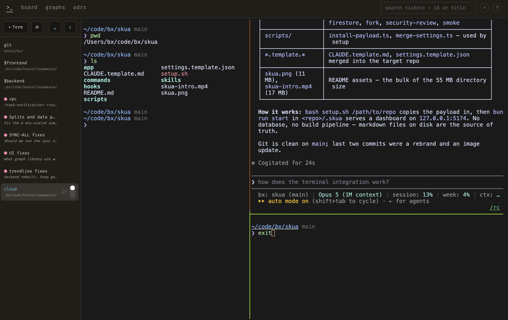
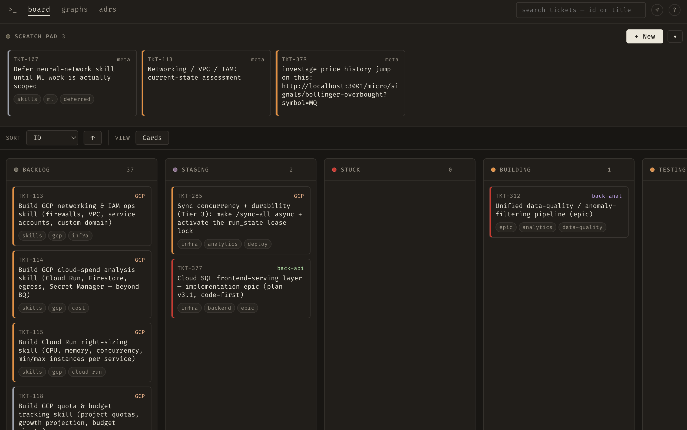
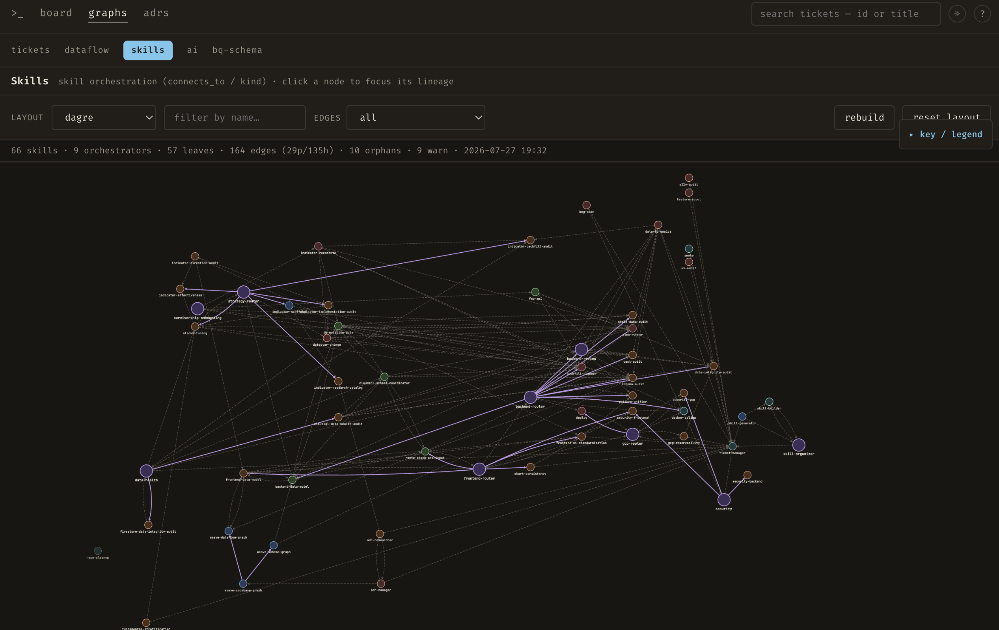

# skua

<p align="center">
  
</p>

A local first, no subscription way to develop full stack applications using your browser on localhost. Designed for Claude code users, but can be easily ported to codex or other CLI agents.


This repo has the following features:
- **Integrated Terminal**: Smart summarization, agent status tracking
- **Ticket board**: Run in Agentic mode where claude skills and hooks run everything, or user mode where you drive.
- **Maps**: Visualize your tickets, AI setup (skills-hooks-tasks etc), architecture, and database.
- **Self improving skills**
- **Repo analysis and ticket backlog fill**

Drop this into any repo. Clone it, run one setup script against your project, and you get a localhost dashboard, a graph of your codebase, and a backlog that fills itself from a bug-scan of your own code 

No database. No build pipeline. No external services. Markdown files on disk are the source of truth, served by a tiny [Bun](https://bun.sh) process on `127.0.0.1`.

<p align="center">
  <em><b><a href="#the-terminal-terminal">The terminals</a></b> — real shells in the browser, each with a live status dot and a summary of what Claude is doing.</em>
  <br>
  
</p>


<p align="center">
  <em><b><a href="#the-board">The board</a></b> — markdown tickets on disk, dragged through the lifecycle buckets (or driven by the <code>ticket-manager</code> skill).</em>
  <br>
  
</p>

<p align="center">
  <em><b><a href="#the-graphs-graphs">The graphs</a></b> — tickets, dataflow, your Claude Code skill/hook ecosystem, database schemas and ADRs, mapped from your repo.</em>
  <br>
  
</p>

Claude Pro subscription (or similar) required, Max subscription suggested for initial setup. An API key can be used, but thats a much more expensive way to run this. Opus model suggested for accuracy in graph and ticket building.


---

## Quickstart

```bash
git clone <this-repo> skua
cd skua
bash setup.sh /path/to/your/repo      # defaults to the current directory

cd /path/to/your/repo/.skua
bun run start                          # → http://127.0.0.1:5174

To kill:  lsof -ti :5174 | xargs kill
```

That's it. Open the URL and you'll see your board, your codebase graph, and (if
Claude Code is installed) a backlog of real findings from your code.

### Requirements

- **[Bun](https://bun.sh)** — runs the dashboard and the CLI. *(required)*
- **[Claude Code](https://claude.com/claude-code)** — powers the `bug-scan` skill
  that fills the backlog from your code. *(optional, but it's the point)*
- **[ttyd](https://github.com/tsl0922/ttyd)** + **[zellij](https://zellij.dev)**
  — power the **Terminal** tab (`brew install ttyd zellij`). *(optional)*

---

## What `setup.sh` does

1. **Vendors the app** — copies the Bun dashboard into `your-repo/.skua/`.
2. **Installs the skills + hooks + commands** into `your-repo/.claude/`,
   **upgrade-safe**: a manifest (`.skua/install-manifest.json`) records every file
   skua writes, so a re-run installs new files, updates ones you haven't touched, and
   **keeps any you've customized** — skua's copy is staged beside it as `*.skua-incoming`,
   never applied. Skua's hooks are namespaced (`skua_*.ts`) and skipped if you already
   run an equivalent hook, so nothing double-fires. Settings merge idempotently; the git
   permission allowlist is **opt-in** (`--git-perms`) so setup never silently widens your
   permissions. Commands include the vendored, stack-agnostic `/security-review` engine
   (MIT) that the `security` skill wraps.
3. **Scaffolds the board** — `your-repo/.tickets/` with the 9 lifecycle buckets
   and an `ADRs/` folder.
4. **Writes `skua.config.json`** and a starter `CLAUDE.md` (only if you don't
   already have one).
5. **Builds the dashboard graphs** — deterministic, no Claude needed. The
   `dataflow` and `schemas` graphs are detected straight from your code here.
6. **Offers the deep `bug-scan`** (if Claude Code is present) — setup *prompts*
   `Run the deep bug-scan now? [y/N]`; on yes it fans out a multi-agent scan,
   adversarially verifies each finding, and files the real bugs into the backlog
   so the board is populated by *your* code from minute one. Decline and run
   `/bug-scan` whenever; force it non-interactively with `--scan`.

Flags: `--scan` (run the bug-scan without prompting), `--no-scan` (skip it
entirely, no prompt), `--start` (launch the board at the end), `--port N`,
`--git-perms` (opt into skua's git allowlist — see below).

> When you opt in, the headless bug-scan pass (`claude -p …`) is best-effort. If
> it doesn't fully complete under your permission settings, just run it
> interactively in Claude Code: `/bug-scan`. Everything else in setup is deterministic.

---

## The board

Tickets are markdown files with YAML frontmatter. They flow through buckets:

```
scratch → 0-backlog → 1-staging → 3-building → 4-testing → 5-validating → 6-complete → 7-archive
                                  ↘ 2-stuck ↗
```

Drag tickets between buckets in the UI, edit them in the browser, or let the
`ticket-manager` skill drive the lifecycle. Completed tickets auto-archive after
7 days.

## Execution modes (how tickets get built)

There are three ways to drive a ticket from backlog to done, in increasing autonomy:

|  | **user-driven** | **agentic** | **chaos** |
|---|---|---|---|
| Human gates | every step | once (commit prompt) | **zero** |
| When stuck | you decide | waits in `2-stuck/` | **decides & proceeds (auto-requeues if truly stuck)** |
| Isolation | current tree | current tree | **`chaos/TKT-NNN` worktree per ticket** |
| Ends at | you move it | `5-validating/` | **merged to `main` (clean) / `/chaos-land` (conflict); branch kept** |
| Start it | just work | the flow-gate | **`/chaos` arming ceremony only** |

**Chaos mode** (`/chaos`) is fully autonomous — no human in the loop. A background
supervisor drains the backlog, running a fresh `claude -p` per ticket in its own git
worktree, deciding every implementation *and* product call itself (competing viewpoint
subagents → best-practice pick → documented), and **building one ticket at a time and
fast-forwarding each validated ticket into `main` as it goes — a single linear history, one
commit per ticket, pushed to origin**. Because it's serial, each ticket builds on a `main`
that already has all the prior work, so landings stay clean; a branch that *does* conflict
(rare) is flagged and deferred to **`/chaos-land`**, which resolves the pile autonomously.
Every `chaos/TKT-NNN` branch is preserved, so any landing is revertible. When the
backlog drains it rotates through its **scouts** — `feature-scout` invents features,
`ux-audit` and `a11y-audit` propose improvements to what already exists — and keeps going,
so the run caps and the usage throttle (pause at 90% of the 5-hour window) are the only brakes.
For full-stack work it keeps architecture coherent by externalizing it — workers read and
extend the ADRs + schema/dataflow graphs rather than inventing parallel patterns, large
features are decomposed contract-first (a shared-contract foundation ticket + loosely-coupled
pieces), and contract-establishing tickets run one at a time.

> ⚠ Chaos requires a **Claude Max** subscription (each ticket runs Opus 4.8 at `xhigh`
> under a usage throttle) and is **experimental** — autonomous coding agents have wiped
> production databases. **It pushes to `main` automatically.** Its safety rests on: only
> `chaos/*` branches are touched and only *clean* merges land automatically (conflicts are
> deferred to `/chaos-land`, never blind-resolved); every landed branch is preserved so any
> landing is revertible; the `chaos-guard` hook blocks history rewrites / force-pushes /
> destructive ops; and nothing arms without the explicit `arm chaos` confirmation. Set
> `land_during_run: false` for the old review-gated behavior (work waits in `5-validating/`).
> Stop a run anytime with `/chaos stop` or `touch .tickets/STOP`.

### Ideation vs. minimalism (the ponytail boundary)

`feature-scout` (the creative layer that invents features) runs with **ponytail OFF** —
ponytail governs *implementation minimalism* (build it with the least code), never
*feature suppression* (what to build). Imagine expansively, build minimally.

## The graphs (`/graphs/...`)

| View | What it shows |
|---|---|
| **tickets** | `depends_on` / `blocks` / `related` across the board. |
| **dataflow** | Architecture diagram — frontend routes → backend container(s)/endpoints → databases, detected per repo. |
| **ai** | The full Claude Code ecosystem — skills, agents, hooks, MCP, settings. |
| **schemas** | Your databases — detects Firestore / SQL / BigQuery usage and maps each one's tables/collections, columns/fields, and relationships. |
| **adrs** | Architecture Decision Records and the tickets that implement them. |

## The terminal (`/terminal`)

Open `zsh` terminals in the browser and run `claude` (or anything) in them. Each
session is a [ttyd](https://github.com/tsl0922/ttyd) process bound to
`127.0.0.1`, backed by a detached [zellij](https://zellij.dev) session that
holds the shell's pty, so it survives page refreshes and dashboard restarts —
and reattach replays the screen, with scrollback kept server-side (wheel to
scroll). Skua runs zellij against its own private socket/config dirs (bare
chrome-less pane, locked mode), so your personal zellij setup is never touched.
The left sidebar lists open sessions; the **+** button (top-left) opens one in
the default working directory set in the bar beside it — which defaults to `~`.
Requires `ttyd` + `zellij` (`brew install ttyd zellij`) — the tab shows an
install hint if they're missing.

Each tab carries a **live status dot** — pulsing amber while something is running
(e.g. Claude working), red when it's waiting on you (a permission prompt), green
when a background run just finished and you haven't looked yet, and nothing when
idle — plus a short **AI summary** of what's happening. Both come from the
local `skua_terminal_live.ts` hook that Claude Code runs inside the session.

> These are fully interactive, writable shells on your machine. ttyd binds to
> localhost only and there's no extra auth — the same trust model as the rest of
> the localhost-only dashboard.
>
> **Status, summaries, and notifications are 100% local.** When Claude Code runs
> in a skua terminal, a hook (`skua_terminal_live.ts`) writes its state, a few-word
> summary of your last prompt, and any pending permission/idle prompt to a local
> file the dashboard reads — no API key, nothing leaves your machine. Terminals
> without the hook (e.g. a plain shell) simply show no status dot.

## Parallel sessions (worktrees)

Multiple `claude` terminals editing the same folder can silently **clobber each
other** — Claude Code has no cross-session file lock, and its read-before-edit
check only guards within a single session. A
[git worktree](https://git-scm.com/docs/git-worktree) gives each session its own
checkout + branch, so concurrent edits never collide; you merge the branches back
through git like any other branch.

Setup vendors a `wt` helper to `<repo>/.skua/wt.sh`. Source it once from your
shell rc (`~/.zshrc` / `~/.bashrc`):

```bash
source /path/to/your-repo/.skua/wt.sh
```

Then, from anywhere inside the repo:

```bash
wt feature-x     # create/reuse a worktree on branch wt/feature-x, then open claude in it
wt ls            # list this repo's worktrees
wt rm feature-x  # remove the worktree (its branch is kept)
```

Worktrees live in a sibling dir (`<repo>-worktrees/<name>`) so they stay out of
skua's graph/dashboard scans, and gitignored `node_modules` are symlinked in so
the vendored dashboard runs immediately in the new tree.

To let those sessions push, run setup with `--git-perms` and it merges a git
permission allowlist (`push` / `branch` / `commit` / `worktree`, plus a best-effort
`--force`/`-f` push guard) into `<repo>/.claude/settings.json`. **It is off by
default** — setup never widens your permission surface unless you ask; without the
flag it just prints the allowlist it would have added. The force-push deny is a speed
bump, not a wall — Claude Code matches permission patterns by command prefix, so
reordered flags (`git push origin main --force`) slip past it. Edit or delete any
of these rules in that file if you'd rather Claude not run git unprompted.

## The skills

| Skill | Kind | What it does |
|---|---|---|
| `ticket-manager` | utility | Owns the `.tickets/` lifecycle. The hub. |
| `bug-scan` | workflow | Fan-out bug hunt → adversarial verify → files backlog tickets. |
| `adr-manager` | workflow | Create / transition / link Architecture Decision Records. |
| `adr-researcher` | audit | Researches a decision and drafts an ADR. |
| `security` | audit | Wraps the off-the-shelf `/security-review` engine and composes findings into the board (dedup, severity, snapshot diff, auto-draft). |
| `skill-builder` | utility | Author and audit skills. |
| `skill-generator` | generator | Bootstrap a skill portfolio for a new repo. |
| `skill-organizer` | orchestrator | Curate an existing portfolio (merges, renames, retirements). |

---

## Layout of this repo

```
skua/
├── setup.sh                 # the installer
├── settings.template.json   # namespaced hooks + (opt-in) git allowlist, merged into the target's .claude/settings.json
├── CLAUDE.template.md        # starter project instructions copied into the target
├── scripts/install-payload.ts # upgrade-safe skills/hooks/commands install (manifest + conflict staging)
├── scripts/merge-settings.ts  # merges template hooks + (opt-in) permissions, with a double-fire guard
├── app/.skua/              # the Bun dashboard, vendored into <target>/.skua
│   ├── server.ts            # Bun.serve + REST API + static serving
│   ├── skua.config.ts      # path/port resolver (env + skua.config.json overrides)
│   ├── wt.sh                # `wt` worktree helper for parallel claude sessions
│   ├── lib/                 # tickets, ADRs, frontmatter, graph builders
│   ├── public/              # vanilla-JS UI (board, ticket editor, Cytoscape graphs)
│   └── scripts/ticket-cli.ts# next-id / audit-ids / create (headless ticket filing)
├── skills/                  # installed into <target>/.claude/skills
├── commands/                # vendored /security-review engine → <target>/.claude/commands
└── hooks/                   # installed into <target>/.claude/hooks (Bun-run, namespaced)
    ├── skua_skill_reflect.ts # end-of-turn skill/script self-reflection
    └── skua_terminal_live.ts # per-terminal live status for the dashboard
```

## Configuration

The vendored layout (`<repo>/.skua` beside `<repo>/.tickets` and
`<repo>/.claude`) works with zero config. To override, edit `skua.config.json`
at your repo root or set env vars:

| Setting | `skua.config.json` | env var | default |
|---|---|---|---|
| Repo root | `repoRoot` | `SKUA_REPO_ROOT` | parent of `.skua/` |
| Tickets dir | `ticketsRoot` | `SKUA_TICKETS_ROOT` | `<repo>/.tickets` |
| ADRs dir | `adrsRoot` | `SKUA_ADRS_ROOT` | `<tickets>/ADRs` |
| Port | `port` | `PORT` | `5174` |

## Notes

- **File-based, localhost-only.** The dashboard server binds `127.0.0.1`, has no
  auth layer, and never runs git itself. Claude Code *sessions*, however, get a
  git allowlist (push / branch / commit / worktree) merged into `.claude/settings.json`
  for the worktree flow — see [Parallel sessions](#parallel-sessions-worktrees).
- `.skua/cache/` holds generated graph JSON; it's safe to delete (rebuilt on
  demand) and is gitignored.
- The board's data — `.tickets/` — is plain markdown. Commit it to version your
  backlog alongside your code, or gitignore it to keep it local.
